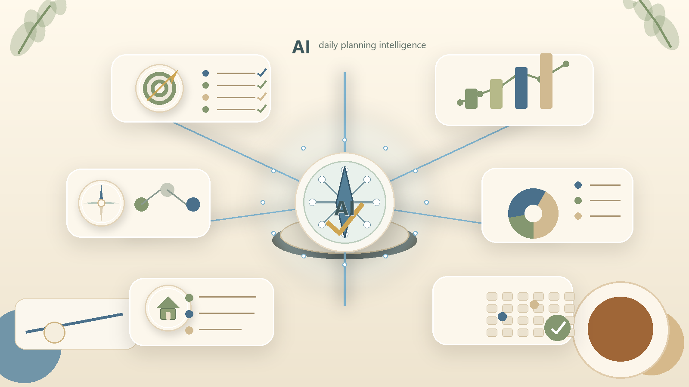
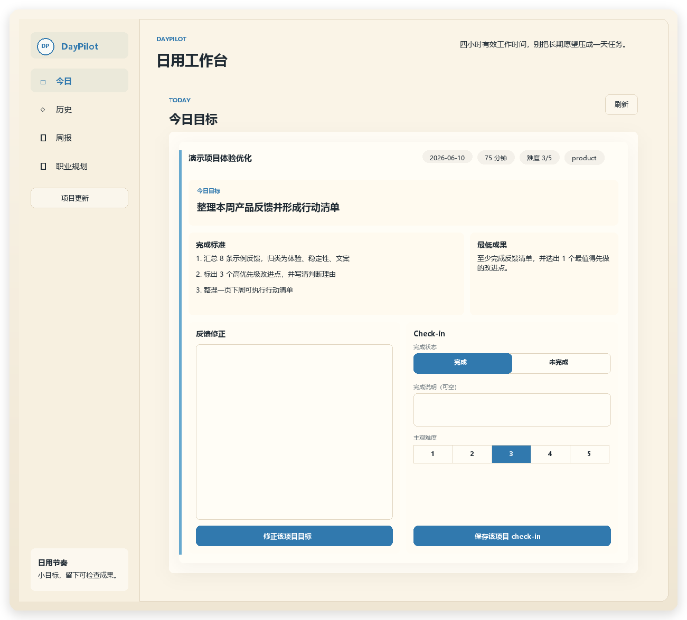
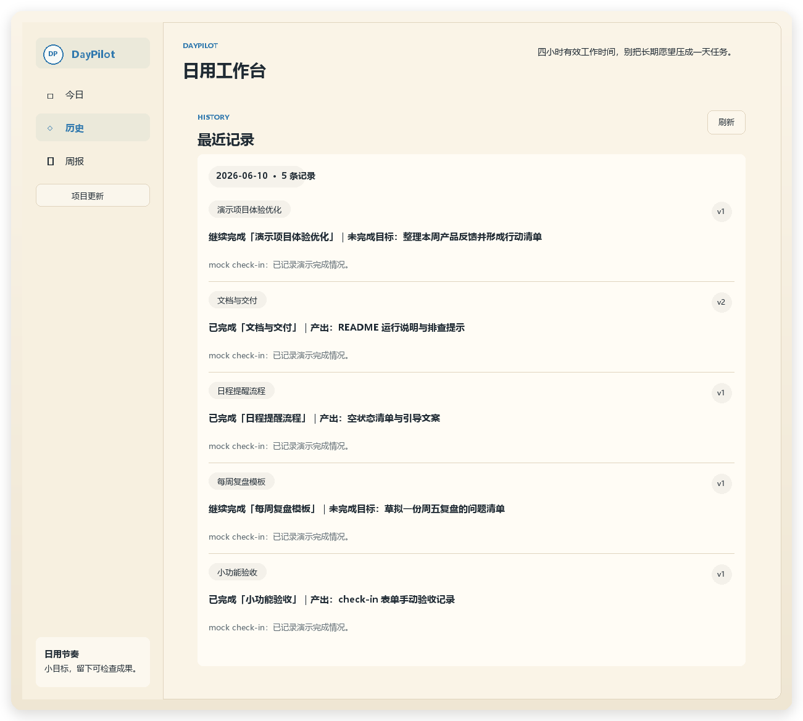

<p align="center">
  
</p>

<p align="center">
  
</p>

<h1 align="center">DayPilot</h1>

<p align="center">A local, private, single-user daily workbench: turn long-term direction into small deliverables for today, then generate a Friday review.</p>

<p align="center">
  <a href="README.md">中文</a>
</p>

<p align="center">
  <a href="LICENSE"></a>
  
  
  
</p>

---

## What Is DayPilot

DayPilot is a personal work agent designed around roughly four effective work hours per day. It does not try to replace your big life planning. Instead, it compresses your long-term direction, current projects, preferences, and constraints into a goal you can deliver, check, and review today.

Its core loop is short:

1. On workdays, it reads your long-term context and current projects, then generates today's goal.
2. During the day, you can revise the goal with feedback, such as narrowing scope, changing the output format, or adjusting the time budget.
3. In the evening, you submit a check-in with completion status, subjective difficulty, and tomorrow's direction.
4. On Friday, it generates a weekly report and next-week focus from the week's records.

By default, data stays on your machine: the SQLite database, LLM logs, backups, and your real `SOUL.md` are not uploaded to external services, except for the DeepSeek API calls you configure.

## Features

**Daily goal**: Generate a small and deliverable goal for the active project, with acceptance criteria, minimum output, time estimate, and difficulty.

**Feedback revision**: On the Today page, enter feedback like "I only have 45 minutes today", "this is too large", or "I want to write code", and DayPilot will generate a new goal version.

**Career planning chat**: In the **Career Planning** tab, talk to a private career-development planning assistant. It reads `SOUL.md`, the structured user profile, project history, ability state, and recent records to help decide what to do with spare time and how to build transferable skills and portfolio evidence.

**Long-term memory**: When feedback reveals a stable preference, such as "do not give me pure learning goals" or "each goal must leave an inspectable output", the system writes it to the database and syncs it into the user profile section of `SOUL.md`.

**Project updates**: Add projects, mark projects complete, and update project status in natural language. The system keeps the current project list in sync.

**End-of-day check-in**: Record completion text, completion status, felt difficulty, and tomorrow's direction as evidence for later goals and weekly reports.

**Weekly review**: Generate a Friday weekly report and next-week focus, then continue giving feedback to create a new version.

## How To Enter Personal Context

DayPilot needs to know who you are, what you are working on, and how you like to work. There are two kinds of input: stable context before startup, and daily context inside the web app.

| Entry | Where to enter it | What to enter | How the system uses it |
| --- | --- | --- | --- |
| DeepSeek config | `.env` | `DEEPSEEK_API_KEY`, model, and timeout settings | The API key is required only when `DAYPILOT_LLM_MODE=deepseek`. The real LLM path uses it to generate goals, interpret feedback, and generate weekly reports. |
| Stable personal profile | `SOUL.md`, copied from `SOUL.example.md` | Long-term direction, current skills, personality and work style, development intentions, career values and constraints, current project boundaries, user preferences, avoid rules, time budget, and goal-generation principles | Read on every agent call as long-term context. Good for stable information, not for temporary same-day details. |
| Career planning chat | Left-side **Career Planning** in the web app | Spare time, career questions, desired direction, current skills, and personality notes | Gives direction analysis, clarifying questions, project suggestions, risks, and next actions. New profile facts become pending suggestions first, then are written to SQLite and `SOUL.md` only after user confirmation. |
| Project changes | Left-side **Project Update** in the web app | "Add project: ... current progress: ... goal: ...", or "this project is complete; the result is ..." | Written to the SQLite project table and reflected in the current-project section of `SOUL.md`. |
| Today's preference or constraint | Today page **Feedback Revision** | "I only have 30 minutes today", "this goal is too large", "I want to do experiments", or "do not give abstract goals later" | First revises today's goal. If it is a stable preference or avoid pattern, it becomes long-term memory. |
| End-of-day facts | Today page **Check-in** | Completion status, completion notes, felt difficulty, and tomorrow's direction | Used as history, project-progress evidence, weekly-report evidence, and the handoff into the next day's goal. |
| Weekly report preference | Weekly page **Weekly Report Feedback** | "Make next week's plan more verifiable" or "do not write it like a diary log" | Generates a new weekly report version and saves stable weekly-report preferences. |

Before the first run, copy `SOUL.example.md` to `SOUL.md`, then edit `SOUL.md`. At minimum, fill in these areas:

```markdown
## Long-Term Direction

What capability I want to build over time, or what direction I want this project to serve.

## Current Projects

1. Project name: current stage, recent blockers, and what I hope to advance today.

## Current Skills

- Python / frontend / backend / data analysis / LLM applications, with evidence.

## Personality And Work Style

- I work best with project-driven learning and plans that leave an output.

## Development Intentions

- Directions I want to deepen, fields I may move toward, and portfolio work I want to build.

## Career Values And Constraints

- I care about long-term compounding, real available time, energy boundaries, and visible deliverables.

## User Preferences

- I prefer small and deliverable goals.
- I want goals to leave code, docs, experiment records, or decision notes.

## Avoid

- Do not compress long-term wishes into one-day tasks.
- Do not give pure reading, watching, or thinking goals unless they leave an output.
```

Do not put API keys, account passwords, or private tokens in `SOUL.md` or the README. API keys belong only in `.env` or system environment variables.

## Screenshots

### Today Workbench

<p align="center">
  
</p>

### History

<p align="center">
  
</p>

## Quick Start

"Starts on any computer" means a Windows, macOS, or Linux machine with Python 3.10+. Mock mode does not need a DeepSeek key; real DeepSeek mode needs access to the DeepSeek API and a valid `DEEPSEEK_API_KEY`. DayPilot currently does not require `npm install` or extra Python dependencies.

### Windows

```bat
cd /d D:\path\to\DayPilot
copy .env.example .env
copy SOUL.example.md SOUL.md
notepad .env
notepad SOUL.md
python scripts\start_daypilot.py
```

If Windows says `python` is unavailable but Python Launcher is installed, replace the last line with `py -3 scripts\start_daypilot.py`. You can also run `scripts\start_daypilot.bat`; it will automatically try both entry points.

For local mock debugging, you do not need a real DeepSeek key. During development, prefer `--restart`; it stops old DayPilot backend/frontend processes, backs up and restarts services, serves frontend files with no-cache headers, and opens a timestamped page:

```bat
cd /d D:\path\to\DayPilot
set "DAYPILOT_LLM_MODE=mock" && python scripts\start_daypilot.py --restart
```

### macOS / Linux

```bash
cd /path/to/DayPilot
cp .env.example .env
cp SOUL.example.md SOUL.md
nano .env
nano SOUL.md
python3 scripts/start_daypilot.py
```

`.env` needs at least:

```text
DAYPILOT_LLM_MODE=deepseek
DEEPSEEK_API_KEY=your_deepseek_api_key
DEEPSEEK_BASE_URL=https://api.deepseek.com
DEEPSEEK_MODEL=deepseek-v4-pro
```

The source-development startup script always uses the repo-local `.env`, `SOUL.md`, and `data/` paths. It checks `DEEPSEEK_API_KEY` in real LLM mode, backs up an existing database, initializes SQLite on first run, starts the backend at `http://127.0.0.1:8000`, starts the frontend at `http://127.0.0.1:5173/pages/index.html`, and opens the browser. With `--restart`, it first stops old DayPilot development or packaged processes on the default ports to avoid occupied ports, stale static assets, or duplicate services showing an outdated page.

Stop services:

```bat
python scripts\stop_daypilot.py
```

The stop script removes repo-local pid files and checks the default 8000/5173 ports for DayPilot processes.

On macOS / Linux:

```bash
python3 scripts/stop_daypilot.py
```

Check the real model connection:

```bat
python scripts\check_deepseek_connection.py
```

## Architecture

```text
backend/api/             HTTP API entry, based on the Python standard library
backend/services/        Daily goal, feedback revision, project progress, weekly report, career chat, SOUL sync
backend/repositories/    SQLite read/write wrappers
backend/schemas/         Agent structured-output JSON Schema
frontend/pages/          Single-page workbench HTML
frontend/services/       Frontend API calls and page interactions
frontend/styles/         Page styles
prompts/                 Goal-generation prompts and examples
evals/                   Agent behavior eval cases, rubrics, and scripts
scripts/                 Start, stop, backup, restore, and connectivity checks
data/                    Local database, backups, temporary files, and LLM logs
docs/                    README image assets and public runbooks
```

Core data flow:

1. `SOUL.md`, the SQLite user profile, project list, and history records form the context.
2. The service layer calls the DeepSeek OpenAI-compatible Chat Completions API and asks for JSON.
3. JSON is written to SQLite after schema validation, normalization, and quality checks.
4. The frontend reads the API and displays Today, History, Weekly, Project Update, and Career Chat.
5. If `SOUL.md` sync fails, the failed task enters the SQLite retry queue and the background maintenance loop retries it.
6. Career chat only saves sessions and messages. Profile updates become pending suggestions first, and are merged into `user_profile.career_profile` and synced to `SOUL.md` only after user confirmation.

## Tech Stack

| Layer | Technology |
| --- | --- |
| Frontend | HTML + CSS + Vanilla JavaScript |
| Backend | Python 3.10+ standard library `ThreadingHTTPServer` |
| Agent runtime | DeepSeek OpenAI-compatible Chat Completions API |
| Fallback | Deterministic mock adapters for tests and failure fallback |
| Database | SQLite |
| Local service | `scripts/serve_frontend.py` no-cache static frontend + Python backend |
| Tests | Self-contained Python test scripts + eval cases/rubrics |

## Platform Support

| Platform | Status |
| --- | --- |
| Windows | Supported: `scripts\start_daypilot.py`, with `.bat` wrappers kept. |
| macOS | Source-run support: use `python3 scripts/start_daypilot.py`. |
| Linux | Source-run support: use `python3 scripts/start_daypilot.py`. |
| Mobile browser | The pages have a responsive layout; the service still needs to run on a computer. |

## Packaging

DayPilot can be packaged with PyInstaller as a Windows EXE or a macOS/Linux folder package. Build on the target OS: build Windows packages on Windows and macOS packages on macOS. The package entrypoint is `scripts/package_launcher.py`; it stores user data in the OS user-data directory instead of the install directory. The source-development launcher still writes to repo-local `data/`.

Windows:

```bat
cd /d D:\tools\vibe_coding\xiangmu\DayPilot
python -m pip install pyinstaller
python scripts\build_windows.py
```

macOS:

```bash
cd /path/to/DayPilot
python3 -m pip install pyinstaller
python3 scripts/build_macos.py
```

See the [Packaging Guide](docs/packaging.md) for details.

## Development And Verification

Run all evals:

```bat
python -m evals.run_all
```

Run backend tests:

```bat
for %f in (backend\tests\test_*.py) do python %f
```

macOS / Linux:

```bash
for f in backend/tests/test_*.py; do python3 "$f"; done
```

Run frontend/API smoke:

```bat
python tests\frontend_api_smoke.py
```

Restore the latest backup:

```bat
python scripts\restore_db.py
```

Windows can also use:

```bat
scripts\restore_latest_db.bat
```

## Current Data Model And Sync Rules

- The current project state is canonical in `projects.project_state`; compatibility fields such as `status_summary` and `planning_bias` are derived from that JSON state for API responses.
- `project_state` stores project summaries, planning guidance, targets, facts, and recent update sources. Project updates, check-in progress, and migration logic write to this canonical state so old historical fields do not overwrite current project intent.
- Changes to project names, summaries, planning guidance, targets, or priority can refresh the corresponding daily goal for the current day.
- The History view shows the current active goal version for each `daily_goal`; older versions remain in the version chain for audit.
- Structured career profile data is stored in `user_profile.career_profile`. Career chat stores `career_chat_sessions` and `career_chat_messages`, but it does not automatically create projects, refresh today's goal, or write check-ins.
- New skills, personality traits, development intentions, preferences, or constraints discovered during chat are saved first as `career_profile_update_suggestions` with `pending` status. Only after user confirmation does the system merge them into SQLite and sync the `Current Skills`, `Personality And Work Style`, `Development Intentions`, and `Career Values And Constraints` sections of `SOUL.md`; dismissed suggestions do not change the profile.

## API Surface

- `GET /health`
- `GET /api/today-goal`
- `GET /api/history?days=30`
- `GET /api/projects`
- `POST /api/checkin`
- `POST /api/today-goal/regenerate`
- `POST /api/goal-feedback`
- `POST /api/projects/lifecycle`
- `POST /api/weekly-report/generate`
- `POST /api/weekly-report/feedback`
- `POST /api/career-chat`
- `GET /api/career-chat/sessions`
- `GET /api/career-chat/history?session_id=...`
- `POST /api/career-chat/profile-suggestion`
- `GET /api/soul-sync/status`
- `POST /api/soul-sync/retry`

## Data Safety

- `.env` is ignored by git and should contain only your local API key.
- `data/db/`, `data/backups/`, `data/tmp/`, and `data/llm_logs/` are ignored by default.
- LLM logs do not write API keys or Authorization headers.
- The startup script backs up an existing SQLite database before starting services.
- Career chat may send chat content to the configured DeepSeek endpoint; with `DAYPILOT_LLM_MODE=mock`, it uses the local deterministic fallback instead.
- The assistant never silently rewrites your career profile. SQLite and `SOUL.md` change only after you confirm the "information to save to profile" in the frontend.
- Before uploading to GitHub, do not commit personal databases, LLM logs, or the private `SOUL.md`; the repository keeps only `SOUL.example.md`.

## License

[Apache License 2.0](LICENSE)

## Links

- [SOUL.example.md](SOUL.example.md)
- [Evaluation Runbook](docs/evaluation/eval_runbook.md)
- [One-Week Trial Runbook](docs/evaluation/one_week_trial_runbook.md)
