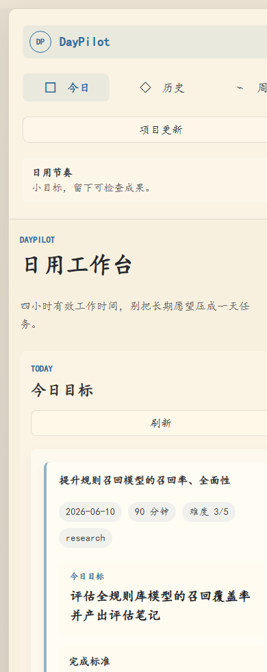

<p align="center">
  
</p>

<p align="center">
  
</p>

<h1 align="center">DayPilot</h1>

<p align="center">一个本地、私有、单用户的日用工作台：把长期方向拆成每天可交付的小目标，并在周五生成复盘。</p>

<p align="center">
  <a href="LICENSE"></a>
  
  
  
</p>

---

## DayPilot 是什么

DayPilot 是一个围绕“每天约 4 小时有效工作时间”设计的个人工作 Agent。它不会替你做宏大人生规划，而是把长期方向、当前项目、偏好和限制，压缩成今天能交付、能检查、能复盘的小目标。

它的核心循环很短：

1. 工作日读取你的长期上下文和当前项目，生成今日目标。
2. 白天可以用反馈修正目标，例如缩小范围、改变产出形式、调整时间预算。
3. 晚上提交 check-in，记录完成情况、主观难度和明日方向。
4. 周五基于一周记录生成周报和下周重点。

数据默认都在本机：SQLite 数据库、LLM 日志、备份文件和你的真实 `SOUL.md` 都不会上传到外部服务，除了你主动配置的 DeepSeek API 调用。

## 功能特性

**每日目标**：为当前 active 项目生成小而可交付的目标，带完成标准、最低成果、时间估计和难度。

**反馈修正**：在 Today 页面输入“今天只有 45 分钟”“这个太大了”“我更想写代码”，DayPilot 会生成新的目标版本。

**长期记忆**：当反馈里出现稳定偏好，例如“以后不要给纯学习目标”“每次都要有可验收产出”，系统会写入数据库，并同步到 `SOUL.md` 的用户画像段落。

**项目更新**：用自然语言添加项目、标记项目完成、更新项目状态，系统会同步当前项目列表。

**日终 check-in**：记录完成文本、完成状态、体感难度和明日方向，作为后续目标和周报的证据。

**周报复盘**：周五生成周报、下周重点，并支持对周报继续反馈生成新版本。

## 个人上下文怎么输入

DayPilot 需要先了解你是谁、你在做什么、你喜欢怎样工作。输入入口分为“启动前的稳定上下文”和“网页里的日常上下文”。

| 入口 | 在哪里输入 | 输入什么 | 系统如何使用 |
| --- | --- | --- | --- |
| DeepSeek 配置 | `.env` | `DEEPSEEK_API_KEY`、模型和超时配置 | 启动时必须存在 API Key；真实 LLM 路径用它生成目标、解释反馈和生成周报。 |
| 稳定个人画像 | `SOUL.md`，由 `SOUL.example.md` 复制而来 | 长期方向、当前项目边界、用户偏好、避免事项、时间预算、目标生成原则 | 每次 Agent 调用都会读取，作为长期上下文。适合写长期稳定的信息，不适合写当天临时情况。 |
| 项目变化 | 网页左侧 **项目更新** | “新增项目：... 当前进度：... 目标：...”，或“某项目已完成，结果是...” | 写入 SQLite 项目表，并更新 `SOUL.md` 的当前项目段落。 |
| 当天偏好/约束 | Today 页 **反馈修正** | “今天只有 30 分钟”“这个目标太大”“更想做实验”“以后不要给抽象目标” | 先修正今日目标；如果是稳定偏好或避免模式，会沉淀为长期记忆。 |
| 日终事实 | Today 页 **Check-in** | 完成状态、完成说明、体感难度、明日方向 | 作为历史记录、项目进展、周报证据和次日目标承接。 |
| 周报偏好 | Weekly 页 **周报修改意见** | “下周计划要更可验收”“不要写成流水账” | 生成新的周报版本，并保存稳定的周报偏好。 |

建议第一次启动前先复制 `SOUL.example.md` 为 `SOUL.md`，再编辑 `SOUL.md`，至少写清楚这些内容：

```markdown
## 长期方向

我长期想形成什么能力，或者希望项目最终服务什么方向。

## 当前项目

1. 项目名：当前阶段、最近阻塞、希望今天推进到什么程度。

## 用户偏好

- 我喜欢小而可交付的目标。
- 我希望目标最后留下代码、文档、实验记录或决策笔记。

## 避免事项

- 不要把长期愿望压成一天任务。
- 不要给纯阅读、纯观看、纯思考的目标，除非它会留下产出。
```

不要把 API Key、账号密码、私密 token 写进 `SOUL.md` 或 README。API Key 只放在 `.env` 或系统环境变量里。

## 截图

### Today 工作台

<p align="center">
  
</p>

### History 最近记录

<p align="center">
  
</p>

### Mobile preview

<p align="center">
  
</p>

## 快速开始

“任何电脑可启动”在这里指：Windows、macOS 或 Linux 上安装了 Python 3.10+，可以访问 DeepSeek API，并且你有有效的 `DEEPSEEK_API_KEY`。DayPilot 当前不需要 `npm install` 或额外 Python 依赖。

### Windows

```bat
cd /d D:\path\to\DayPilot
copy .env.example .env
copy SOUL.example.md SOUL.md
notepad .env
notepad SOUL.md
python scripts\start_daypilot.py
```

如果 Windows 提示 `python` 不可用，但已安装 Python Launcher，可以把最后一行换成 `py -3 scripts\start_daypilot.py`；也可以直接运行 `scripts\start_daypilot.bat`，它会自动尝试这两种入口。

### macOS / Linux

```bash
cd /path/to/DayPilot
cp .env.example .env
cp SOUL.example.md SOUL.md
nano .env
nano SOUL.md
python3 scripts/start_daypilot.py
```

`.env` 至少需要：

```text
DAYPILOT_LLM_MODE=deepseek
DEEPSEEK_API_KEY=your_deepseek_api_key
DEEPSEEK_BASE_URL=https://api.deepseek.com
DEEPSEEK_MODEL=deepseek-v4-pro
```

启动脚本会自动完成这些事：检查 `DEEPSEEK_API_KEY`、备份已有数据库、首次运行时初始化 SQLite、启动后端 `http://127.0.0.1:8000`、启动前端 `http://127.0.0.1:5173/pages/index.html`，并打开浏览器。

停止服务：

```bat
python scripts\stop_daypilot.py
```

macOS / Linux 使用：

```bash
python3 scripts/stop_daypilot.py
```

真实模型连通性检查：

```bat
python scripts\check_deepseek_connection.py
```

## 架构

```text
backend/api/             HTTP API 入口，基于 Python 标准库
backend/services/        每日目标、反馈修正、项目进展、周报、SOUL 同步
backend/repositories/    SQLite 读写封装
backend/schemas/         Agent 结构化输出 JSON Schema
frontend/pages/          单页工作台 HTML
frontend/services/       前端 API 调用和页面交互
frontend/styles/         页面样式
prompts/                 目标生成 Prompt 和示例
evals/                   Agent 行为评估用例、rubric 和脚本
scripts/                 启动、停止、备份、恢复、连通性检查
data/                    本地数据库、备份、临时文件和 LLM 日志
docs/                    架构、实现、评估文档和 README 图片资产
```

核心数据流：

1. `SOUL.md`、SQLite 用户画像、项目列表和历史记录组成上下文。
2. 服务层调用 DeepSeek OpenAI-compatible Chat Completions API，要求返回 JSON。
3. JSON 通过 schema、归一化和质量检查后写入 SQLite。
4. 前端读取 API，展示 Today、History、Weekly 和 Project Update。
5. 如果 `SOUL.md` 同步失败，失败任务会进入 SQLite retry queue，后台维护循环会重试。

## 技术栈

| 层级 | 技术 |
| --- | --- |
| 前端 | HTML + CSS + Vanilla JavaScript |
| 后端 | Python 3.10+ 标准库 `ThreadingHTTPServer` |
| Agent 运行时 | DeepSeek OpenAI-compatible Chat Completions API |
| Fallback | Deterministic mock adapters，用于测试和故障兜底 |
| 数据库 | SQLite |
| 本地服务 | Python `http.server` 静态前端 + Python 后端 |
| 测试 | 自包含 Python 测试脚本 + eval cases/rubrics |

## 平台支持

| 平台 | 状态 |
| --- | --- |
| Windows | 已支持：`scripts\start_daypilot.py`，并保留 `.bat` wrapper。 |
| macOS | 源码运行支持：使用 `python3 scripts/start_daypilot.py`。 |
| Linux | 源码运行支持：使用 `python3 scripts/start_daypilot.py`。 |
| 移动端浏览器 | 页面有响应式布局；服务仍需要在一台电脑上启动。 |

## 开发与验证

运行所有 eval：

```bat
python -m evals.run_all
```

运行后端测试：

```bat
for %f in (backend\tests\test_*.py) do python %f
```

macOS / Linux：

```bash
for f in backend/tests/test_*.py; do python3 "$f"; done
```

运行前端/API smoke：

```bat
python tests\frontend_api_smoke.py
```

恢复最新备份：

```bat
python scripts\restore_db.py
```

Windows 也可以使用：

```bat
scripts\restore_latest_db.bat
```

## API Surface

- `GET /health`
- `GET /api/today-goal`
- `GET /api/history?days=30`
- `GET /api/projects`
- `POST /api/checkin`
- `POST /api/today-goal/regenerate`
- `POST /api/goal-feedback`
- `POST /api/projects/lifecycle`
- `POST /api/weekly-report/generate`
- `POST /api/weekly-report/feedback`
- `GET /api/soul-sync/status`
- `POST /api/soul-sync/retry`

## 数据安全

- `.env` 被 git 忽略，里面只放本机 API Key。
- `data/db/`、`data/backups/`、`data/tmp/`、`data/llm_logs/` 默认被 git 忽略。
- LLM 日志不会写入 API Key 或 Authorization header。
- 启动脚本会在服务启动前备份已有 SQLite 数据库。
- 上传 GitHub 前不要提交个人数据库、LLM 日志或私密版 `SOUL.md`；仓库只保留 `SOUL.example.md`。

## 许可证

[Apache License 2.0](LICENSE)

## 链接

- [SOUL.example.md](SOUL.example.md)
- [实现步骤指南](docs/implementation/step_5_14_acceptance_log.md)
- [评估 Runbook](docs/evaluation/eval_runbook.md)
- [一周试用 Runbook](docs/evaluation/one_week_trial_runbook.md)
